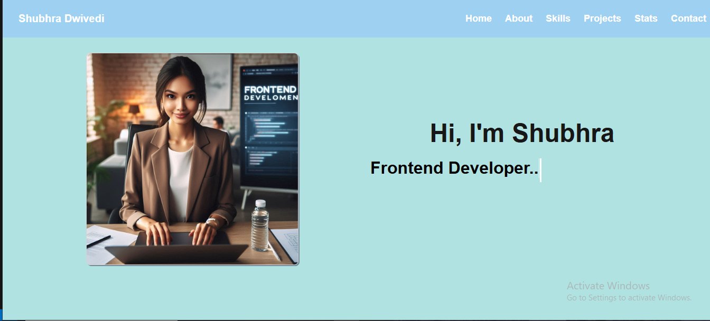
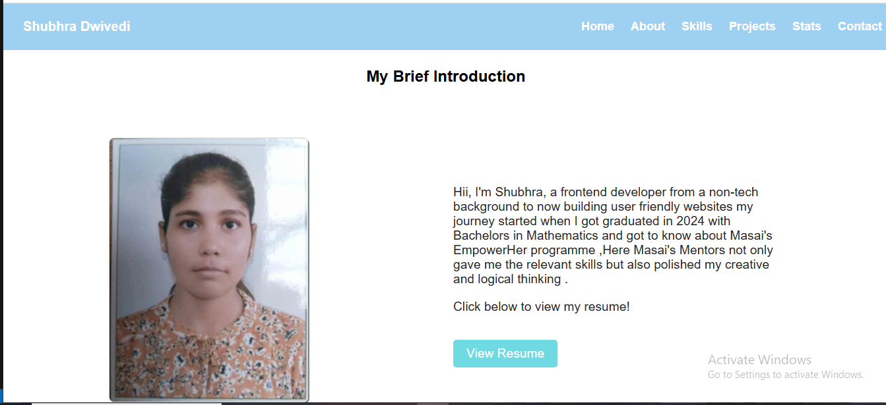
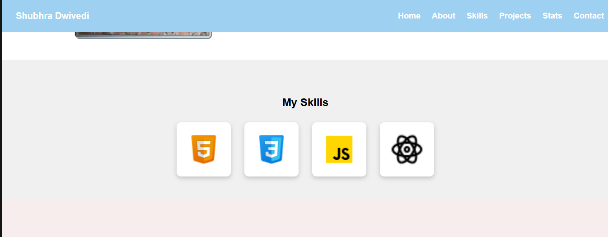
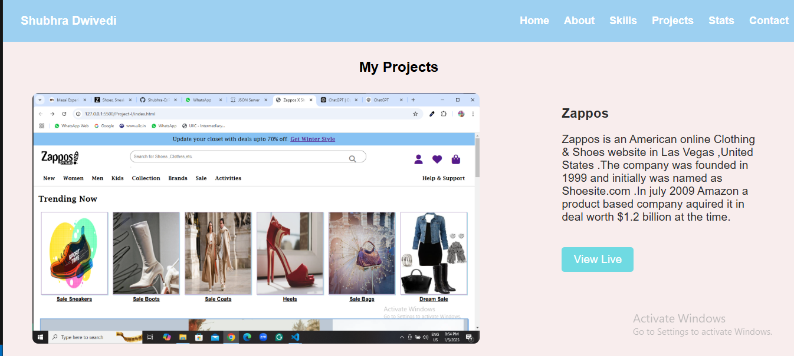
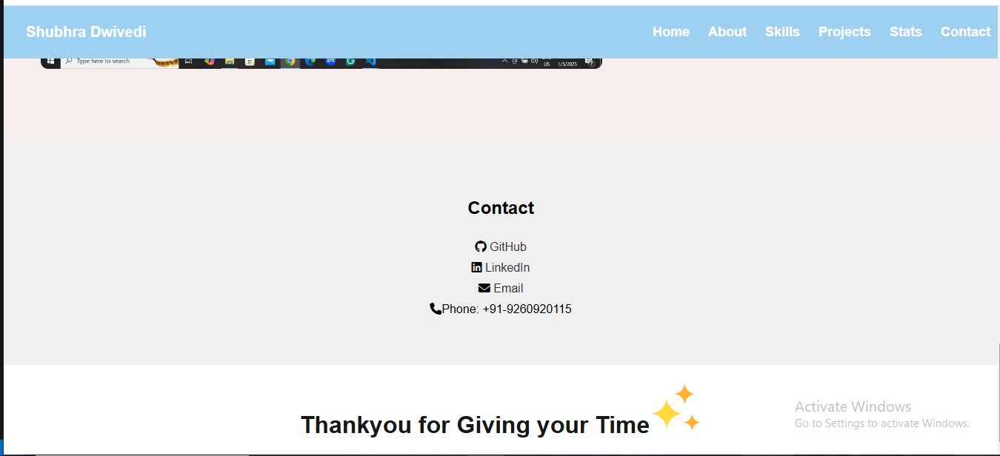

# 🚀 My Portfolio

Welcome to my portfolio repository! This project showcases my work, skills, and projects as a **Frontend Web Developer**. Built using **HTML, CSS, and JavaScript**, it features a responsive design, interactive components, and a user-friendly experience.

## 📌 Features

- 🌐 **Responsive Design** – Works on all screen sizes.
- 🎨 **Modern UI** – Clean and visually appealing layout.
- ⚡ **Smooth Animations** – Enhances user experience.
- 📂 **Projects Section** – Highlights my  work.
- 📞 **Contact Form** – Allows visitors to reach out easily.

## 🛠️ Technologies Used

- **Frontend:** HTML, CSS, JavaScript  
 

## 📸 Screenshots
# Home Page

# About Page

# Skill Page

# Project Page

# Contact Page

## 🚀 Live Demo

🔗 [View Portfolio](https://shubhra-d.github.io/Portfolio-Js/)

## 📝 Setup Instructions

1. Clone the repository:
   ```sh
   git clone https://github.com/Shubhra-D/Portfolio-Js.git

2. File Structure
 > assests
 
 > index.html

 > styles.css
 
 > script.js

